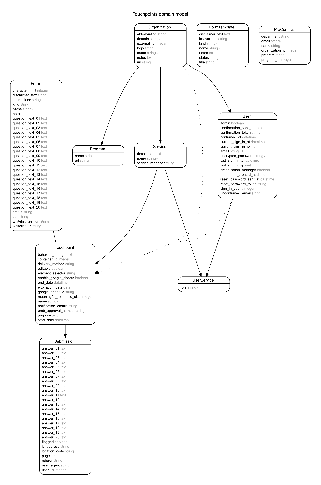

# Data Model

Below is a visual representation of [`db/seeds.rb`](../../db/schema.rb).

The diagram was generated with [rails-erd](https://github.com/voormedia/rails-erd)

##### How can I update this diagram?

After making any changes to `db/schema.rb`,
run `erd` to create `erd.pdf`. Convert that erd.pdf to .png (using OSX Preview).
Then update assets/erd.png ✅

##### How can I install rails-erd?

rails-erd requires Graphviz. On Mac OSX, Install graphviz using `brew install graphviz`.
Run `gem install rails-erd` to install rails-erd.
